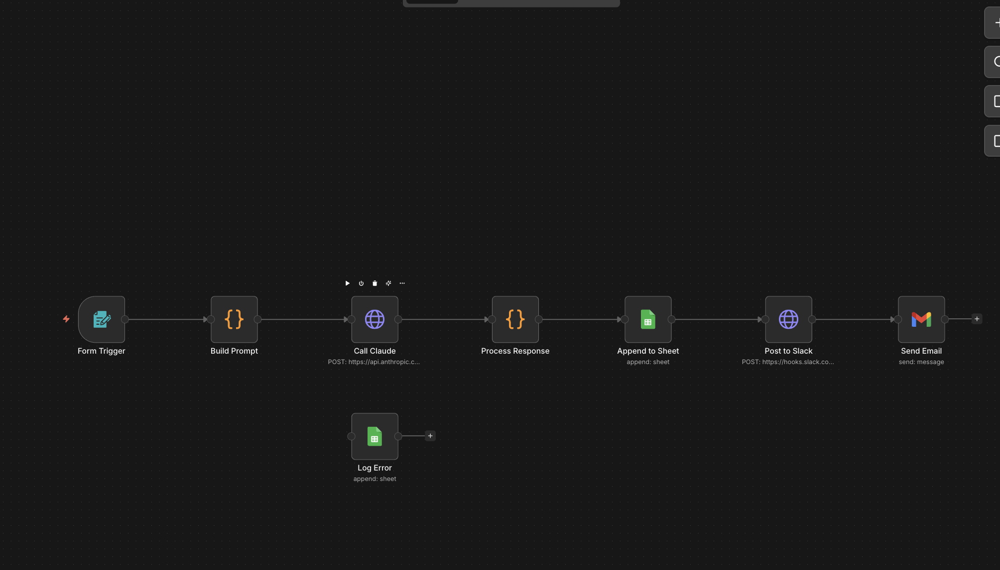
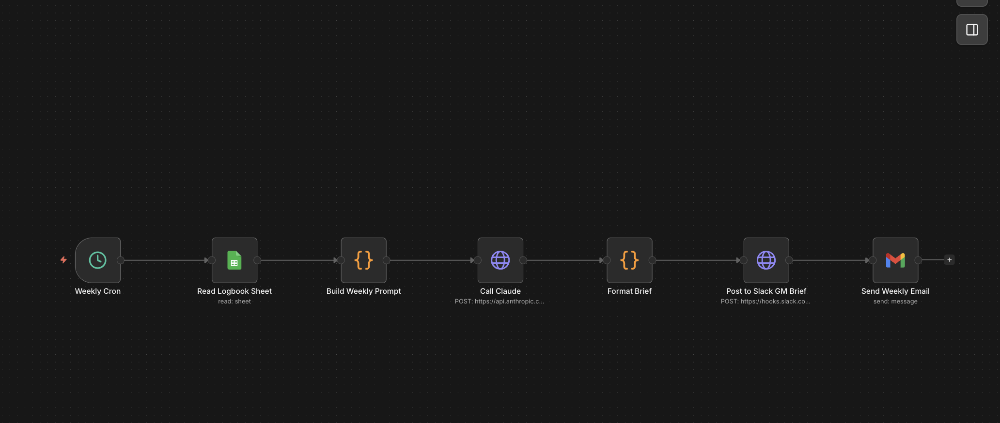
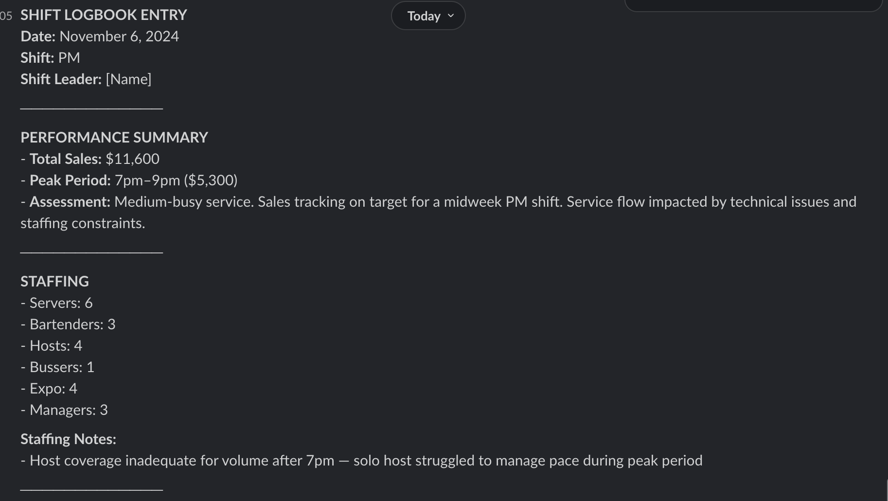
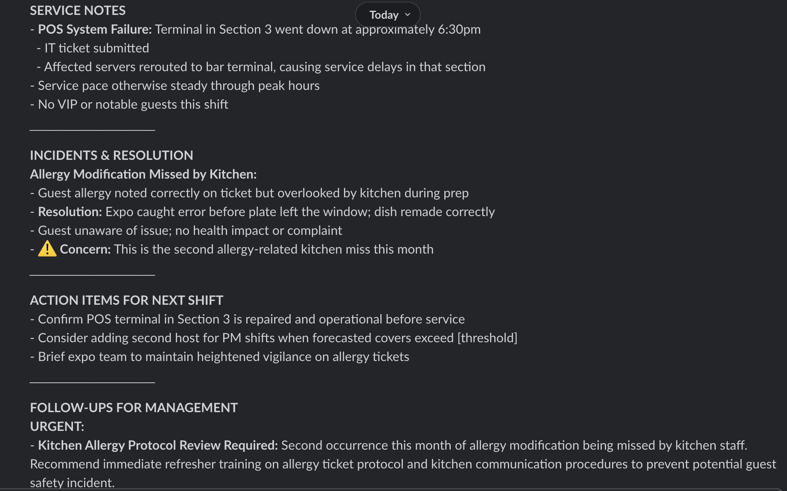
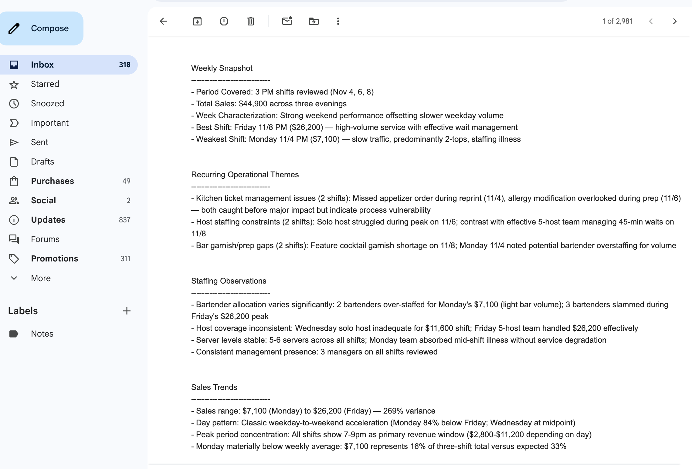

# LogbookAI — AI-Assisted Nightly Logbook Automation

## The problem

Restaurant FOH managers spend 10–20 minutes after every shift filling in a nightly logbook: staffing counts, sales figures, service notes, incidents, and action items for the next team. The notes are usually written quickly under pressure, inconsistently formatted, and rarely read with any analytical lens. By the end of the week, a GM reviewing seven days of entries is doing pattern-recognition work across loosely-structured text, which a natural fit for LLM-assisted synthesis.

LogbookAI replaces that manual process with a two-workflow automation pipeline built on n8n and Claude.

## How it works

**Nightly workflow:** A shift leader fills in a structured form (built into n8n — no external app needed). The form captures staffing counts, time-bucketed sales totals, and a free-text narrative. That data is sent to Claude via the Anthropic API, which formats it into a consistent six-section logbook entry. The entry is posted to a Slack channel, appended to a Google Sheet, and emailed to the manager automatically, in under 30 seconds.

**Weekly workflow:** Every Sunday evening, a scheduled n8n workflow reads the past seven days of logbook entries from the Google Sheet and sends them to Claude for synthesis. The output is a GM-facing brief covering recurring operational themes, staffing patterns, sales trends, and unresolved action items, exactly what a general manager needs before their weekly team meeting.

# What it looks like

## Workflow Logbook



## Workflow GM Brief



## Slack Messages





## GM Email Brief




## Tech stack

| Layer | Tool |
|---|---|
| Workflow orchestration | [n8n](https://n8n.io) (self-hosted via Docker) |
| LLM | Anthropic Claude (claude-sonnet-4-5) via HTTP API |
| Data store | Google Sheets |
| Notifications | Slack (Incoming Webhooks) + Gmail |
| Infrastructure | Docker Compose |

## What's intentionally out of scope

- **Real POS, scheduling, or HRIS integration.** This is a demo of the pattern, not a production tool. Real integrations would require per-vendor API work and auth provisioning that's organization-specific.
- **Multi-location / multi-tenant logic.** The demo models a single restaurant. Extending to a chain would mean adding a location dimension to the sheet schema and per-location Slack routing.
- **Fine-grained access control.** The n8n form trigger is open; in production, entries would authenticate against an existing identity provider.
- **Observability beyond basic error logging.** For production, you'd want structured logging, retry policies, and alerting on Claude API failures.

## Repository structure

```
├── docker-compose.yml          # Runs n8n locally
├── .env.example                # Credential reference
├── workflows/
│   ├── nightly-logbook.json    # n8n workflow: form → Claude → Sheets + Slack + Gmail
│   └── weekly-brief.json       # n8n workflow: cron → Sheets read → Claude → Slack + Gmail
├── prompts/
│   ├── nightly-logbook-system.md   # Claude system prompt for nightly entries
│   └── weekly-brief-system.md      # Claude system prompt for weekly GM brief
└── docs/
    ├── sample-inputs.md        # 4 example form submissions (generic fake data)
    ├── sample-outputs.md       # Corresponding AI-generated logbook entries
    ├── weekly-brief-example.md # Example weekly GM brief output
    └── architecture.md         # Architecture decisions and extension notes
```

## Setup

### Prerequisites

- Docker and Docker Compose installed
- Anthropic API key ([console.anthropic.com](https://console.anthropic.com))
- Google Cloud project with Sheets API and Gmail API enabled, OAuth 2.0 credentials created
- Slack workspace with two Incoming Webhooks: one for `#logbook`, one for `#gm-brief`

### 1. Start n8n

```bash
cp .env.example .env
# Edit .env to set your preferred n8n username and password
docker compose up -d
```

Open [http://localhost:5678](http://localhost:5678) and log in with the credentials from `.env`.

### 2. Configure credentials in n8n

In the n8n UI, go to **Credentials** and add:

- **HTTP Request (Header Auth):** Header name `x-api-key`, value = your Anthropic API key
- **Google Sheets OAuth2:** Use your GCP Client ID and Client Secret; authorize via the OAuth flow
- **Gmail OAuth2:** Same GCP credentials (reuse the same OAuth app)

### 3. Import the workflows

- Go to **Workflows → Import from file**
- Import `workflows/nightly-logbook.json`
- Import `workflows/weekly-brief.json`
- Open each workflow and update any credential references and hardcoded IDs (Slack webhook URLs, Google Sheet ID) per the inline notes

### 4. Set up the Google Sheet

Create a new Google Sheet with two tabs:
- `logbook` — columns: `date`, `shift_type`, `staffing_json`, `sales_json`, `raw_notes`, `ai_formatted_entry`, `action_items`, `follow_ups`, `created_at`
- `errors` — columns: `timestamp`, `workflow`, `step`, `error_message`

Copy the Sheet ID from the URL and paste it into the Google Sheets nodes in both workflows.

### 5. Test

Activate the nightly workflow and open its form URL (shown in the Form Trigger node). Submit a test entry using the examples in `docs/sample-inputs.md`. Verify the entry appears in Slack, the Sheet, and your inbox.

---

## What I learned

Building this project surfaced a few non-obvious lessons:

**Prompt structure matters more than prompt length.** The first version of the nightly prompt produced verbose, inconsistent output. Adding explicit section headers and output rules (what to do when a field is empty, how to handle escalations) made the output immediately more consistent without increasing token count much.

**n8n's expression engine is both powerful and fragile.** Referencing upstream node output via `{{ $node["NodeName"].json.field }}` works well, but the syntax is unforgiving. A typo in a node name silently returns undefined. Naming nodes clearly and testing expressions in the n8n expression editor before running the full workflow saves debugging time.

**OAuth setup is the real setup cost.** The Google Cloud OAuth consent screen, API enablement, and redirect URI configuration took longer than building either workflow. In a real deployment this would be handled once at the organization level; for a local prototype, budget 60–90 minutes the first time.

**Knowing what to leave out was harder than knowing what to build.** The obvious next features: multi-location support, POS integration, a custom frontend, role-based access, would all make this production-worthy but none would make it a better demonstration of the pattern. Holding the line at "n8n does the orchestration, Claude does the judgment, existing SaaS tools do the delivery" kept the project honest about what it is: a proof of shape, not a product.

**Separation of prompts from workflows pays off immediately.** Keeping the system prompts in `prompts/*.md` made them easy to iterate on without opening n8n. When the weekly brief output was too verbose, I could edit and test the prompt in isolation before updating the workflow.
